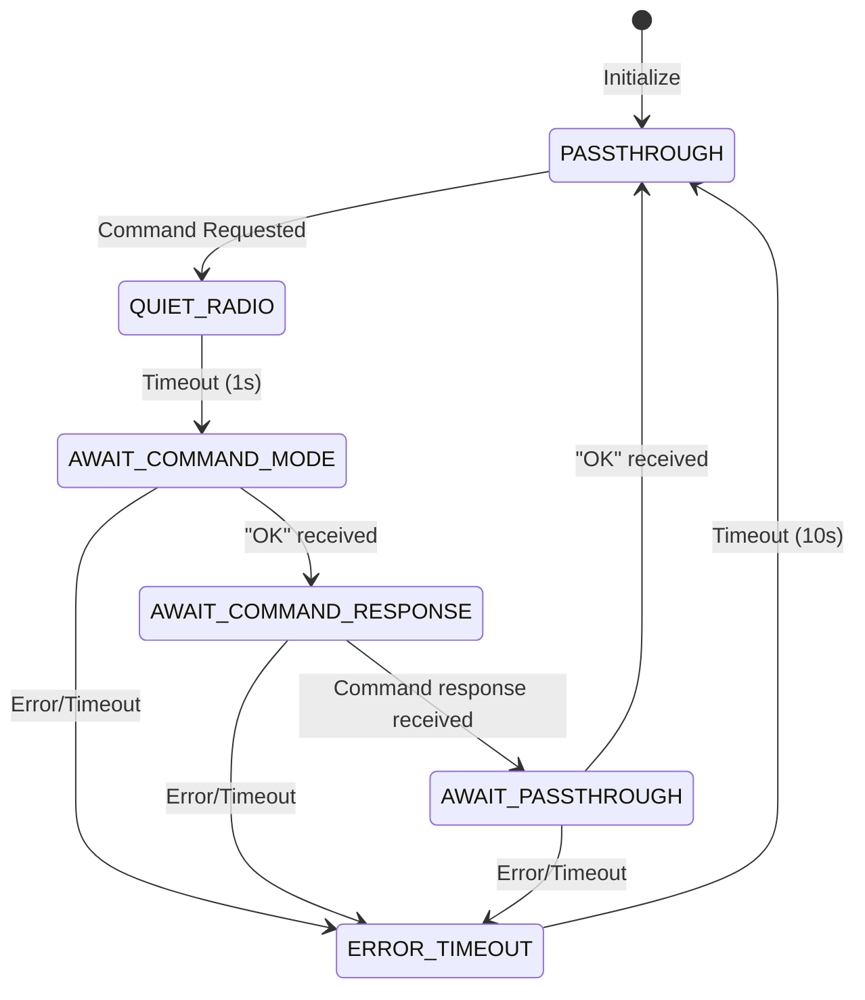

# XBee::XBeeManager

## 1. Introduction

`XBee::XBeeManager` is an F´ component that implements the `Svc.Com` interface for communications management for XBee radio modules. It implements
passing data through the radio via a ByteStreamDriver (UART), as well as a commanding mode for the XBee modules (`+++`, `ATxx` commands etc.).

## 2. Assumptions

The `XBee::XBeeManager` assumes that:
- An XBee radio is connected via a UART/ByteStream driver
- The XBee radio is configured to respond to AT commands in command mode
- The radio supports the standard XBee AT command set (ATNI, ATED, ATCN, etc.)
- The underlying driver provides reliable data transmission and reception

## 3. Requirements

| Requirement        | Description                                                                                                   | Rationale                                                          | Verification Method |
|--------------------|---------------------------------------------------------------------------------------------------------------|--------------------------------------------------------------------|---------------------|
| XBEE-MANAGER-001   | `XBee::XBeeManager` shall implement the `Svc.Com` interface (Communications Adapter)  | The XBeeManager component is the wrapper component to send and receive data through the XBee radio          | Inspection           |
| XBEE-MANAGER-002   | `XBee::XBeeManager` shall accept `Fw::Buffer` for transmission in passthrough mode                           | The comm interface must send data through the XBee radio          | Inspection           |
| XBEE-MANAGER-003   | `XBee::XBeeManager` shall emit success/failure status on communication operations                            | Status feedback is required for communication health monitoring    | Inspection           |
| XBEE-MANAGER-004   | `XBee::XBeeManager` shall support XBee command mode for radio configuration and status queries              | XBee radios require command mode for configuration operations      | Inspection           |
| XBEE-MANAGER-005   | `XBee::XBeeManager` shall implement timeout protection for command mode operations                           | Command mode operations must not hang indefinitely                 | Inspection           |
| XBEE-MANAGER-006   | `XBee::XBeeManager` shall support node identifier retrieval via ATNI command                                | Radio identification is needed for network management              | Inspection           |
| XBEE-MANAGER-006   | `XBee::XBeeManager` shall support energy density scanning via ATED command                                  | Channel analysis is needed for optimal frequency selection         | Inspection           |
| XBEE-MANAGER-007   | `XBee::XBeeManager` shall automatically return to passthrough mode after command operations                 | Normal data flow must resume after configuration operations        | Inspection           | 

## 4. Design

The `XBee::XBeeManager` component implements a state machine-based approach to manage XBee radio communications.
It operates in different modes: **passthrough mode** for normal data transmission and command modes for radio configuration and queries.

The component maintains a state machine for command mode operations:

**XBee Command Mode State Machine**

The component interfaces with a `Drv::ByteStreamDriverModel` for low-level UART communication:

### 4.1. Ports

`XBee::XBeeManager` has the following ports. The component implements both the standard communication interface and XBee-specific management functionality.

| Required | Kind         | Name                 | Port Type             | Usage                                                                             |
|----------|--------------|----------------------|-----------------------|-----------------------------------------------------------------------------------|
| Yes      | `sync input` | `dataIn`             | `Svc.ComDataWithContext`             | Port receiving `Fw::Buffer`s for transmission (from `Svc::Framer`)               |
| Yes      | `output`     | `comStatusOut`       | `Svc.ComDataWithContextStatus`       | Port indicating communication status to attached `Svc::ComQueue`                  |
| Yes      | `output`     | `dataOut`            | `Svc.ComDataWithContext`             | Port providing received `Fw::Buffers` to `Svc::Deframer`                         |
| Yes      | `sync input` | `dataReturnIn`       | `Svc.ComDataWithContext`             | Port receiving buffer ownership return from downstream components                  |
| Yes      | `output`     | `dataReturnOut`      | `Svc.ComDataWithContext`             | Port returning buffer ownership to upstream components                             |
| Yes      | `sync input` | `drvConnected`       | `Drv.ByteStreamReady` | Port called when the underlying UART driver has connected                         |
| Yes      | `sync input` | `drvReceiveIn`       | `Drv.ByteStreamData`  | Port receiving `Fw::Buffers` from UART driver                                     |
| Yes      | `output`     | `drvReceiveReturnOut`| `Fw.BufferSend`       | Port returning buffer ownership to UART driver                                    |
| Yes      | `output`     | `drvSendOut`         | `Drv.ByteStreamSend`  | Port sending `Fw::Buffers` to UART driver                                         |
| Yes      | `sync input` | `run`                | `Svc.Sched`           | Port carrying 1Hz tick for timeout tracking and state machine management          |
| Yes      | `output`     | `allocate`           | `Fw.BufferGet`        | Port for allocating buffers for command operations                                |
| Yes      | `output`     | `deallocate`         | `Fw.BufferSend`       | Port for deallocating buffers after command operations                            |

### 4.4. Commands

| Command                | Description                                           | Parameters | Response                           |
|------------------------|-------------------------------------------------------|------------|------------------------------------|
| `ReportNodeIdentifier` | Retrieves and reports the XBee radio node identifier | None       | Event with identifier string       |
| `EnergyDensityScan`    | Performs energy density scan on all channels         | None       | Telemetry with channel energy data |

### 4.5. Events

| Event                 | Severity | Description                                    |
|-----------------------|----------|------------------------------------------------|
| `RadioNodeIdentifier` | Activity | Reports the radio's node identifier string    |

### 4.6. Telemetry

| Channel         | Type               | Description                                    |
|-----------------|--------------------|------------------------------------------------|
| `EnergyDensity` | `EnergyDensityType`| 16-element array of energy density per channel|
